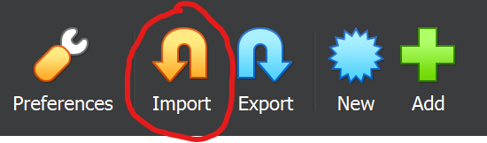

# Setup a VirtualBox VM that lets you run eBPF Programs

1. Download the [VirtualBox Image](https://drive.google.com/drive/u/0/folders/1_KHrdGazWRv_d8kZ96XxH5Z_eG2xBToe).
2. Download and install [VirtualBox](https://www.virtualbox.org/wiki/Downloads). Tested: 7.0.12 Windows Hosts
3. Import the downloaded image
<br></br>
4. Start the Virtual Machine
5. When prompted, login with the following credentials
```
username: ebpf-workshop
password: password
```
6. Navigate to the ebpf directory
```
cd ebpf
```
7. Update the git repository
```
git pull
```
8. Open Visual Studio Code, install the `Remote Development` extension.
9. Press `F1`, type `Remote-SSH: Connect to Host...`
10. Type the ssh connection string
```
ssh ebpf-workshop@localhost -p 2222
```
11. Go through the dialogue, type the password when prompted, confirm the fingerprint etc.
12. Open the folder `ebpf` in the remote.
13. Open a terminal, navigate to the `ebpf-python` folder
14. Run
```
sudo python3 Workshop/ebpf_hello_world.py
```
15. If you see Many `Hello World`'s -> Congratulations, you are all set!

EDIT: Port 2222 sometimes also gets used by WSL. If you have WSL active, change the port forwarding rule in Oracle VM to an unused port, e.g. 2345
