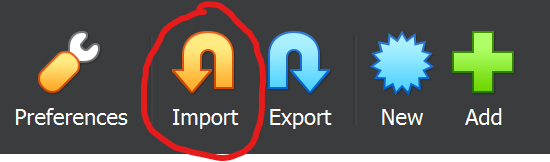

# Setup a VirtualBox VM that lets you run eBPF Programs

1. Download the [VirtualBox Image](https://drive.google.com/drive/u/0/folders/1_KHrdGazWRv_d8kZ96XxH5Z_eG2xBToe).
2. Download and install [VirtualBox](https://www.virtualbox.org/wiki/Downloads). Tested: 7.0.12 Windows Hosts
3. Import the downloaded image
<br></br>
4. Start the Virtual Machine
5. When prompted, login with the following credentials
```
username: ebpf-workshop
password: password
```
6. Navigate to the ebpf directory
```
cd ebpf
```
7. Update the git repository
```
git pull
```
8. Congratulations, you are done! Minimize the window and switch back to your favorite editor, preferably Visual Studio Code.